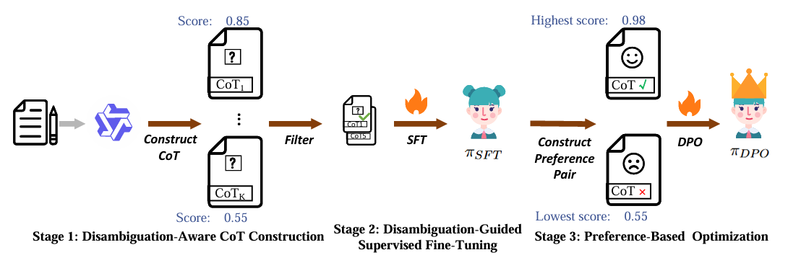

### WSDPO
WSDPO is motivated by the limitation of existing generative WSD methods, which mainly rely on simple supervised fine-tuning and tend to learn surface generation patterns rather than truly discriminating word senses, leading to poor performance on rare and unseen senses. To address this, WSDPO introduces a “disambiguate-then-generate” training mechanism that combines disambiguation-aware chain-of-thought and preference optimization, enabling the model to produce more sense-faithful and accurate WSD outputs.

## Architecture


### How to use

### Step 0: Environment Setup

**Install Lllamafactory=0.9.4**

```bash
conda create -n WSDPO python=3.11.11
conda activate WSDPO
git clone https://github.com/hiyouga/LLaMA-Factory.git
cd LLaMA-Factory 
pip install -e ".[torch,metrics]"
```
**Install vllm=0.12.0**

```bash
conda activate WSDPO
pip install vllm=0.12.0
```

### Stage 1: Disambiguation-Aware CoT Construction

The first step of WSDPO is to use Qwen2.5-72B-Instruction to augment the training data, that is, to generate a chain-of-thought (CoT) that first performs disambiguation and then generates a definition for each instance in SemCor. Run to following script in root directory: 

```bash
cd src
python  CoT_Construction.py --sample_budget 6 --api_key ...
```
 `sample_budget` specifies how many chain-of-thought solution paths to synthesize for each data point in the training set. 


Then, calculate the DGQS based on the gold gloss and filter out entries with a score lower than 0.8.
```bash

cd ../utils
python CoT_Clean.py
```

Then, convert it into a format compatible with the training framework.
```bash
python CoT_Trans.py
```

```bash
Finally, for subsequent training, you need to register the data into the LLaMA-Factory dataset list. To do this, insert the following content into `/LLaMA-Factory/data/dataset_info.json` to complete the registration:

```json
"syn_cot_bird": {
    "file_name": "syn_cot_filtered_clean.json",
    "formatting": "sharegpt",
    "columns": {
      "messages": "messages"
    },
    "tags": {
      "role_tag": "role",
      "content_tag": "content",
      "user_tag": "user",
      "assistant_tag": "assistant",
      "system_tag": "system"
    }
}
```

### Stage 2: Disambiguation-Guided Supervised Fine-Tuning

Run the following script in the LLaMA-Factory directory to perform supervised fine-tuning using 4 GPUs. You need to replace `model_name_or_path` and `output_dir`.

```bash

conda activate WSDPO
CUDA_VISIBLE_DEVICES=0,1,2,3 \
llamafactory-cli train \
    --model_name_or_path ../Models/Llama-3.2-3B-Instruct \
    --stage sft \
    --do_train \
    --finetuning_type lora \
    --lora_rank 8 \
    --lora_alpha 16 \
    --lora_target all \
    --dataset syn_cot_bird \
    --template llama3 \
    --cutoff_len 1024 \
    --overwrite_cache \
    --preprocessing_num_workers 16 \
    --output_dir ../outputs/COT_SFT_filtered \
    --logging_steps 5 \
    --report_to tensorboard \
    --run_name lora_sft \
    --save_strategy epoch \
    --overwrite_output_dir \
    --per_device_train_batch_size 8 \
    --gradient_accumulation_steps 2 \
    --learning_rate 1e-4 \
    --num_train_epochs 4 \
    --lr_scheduler_type cosine \
    --warmup_ratio 0.05 \
    --bf16 \
    --use_fast_tokenizer \
    --flash_attn fa2 \
```


### Stage 3: Preference-Based  Optimization

First, use the following command to perform 4-GPU parallel sampling on the SemCor train set using the reference model.


```bash
cd src
bash multi-device_sample.sh -i semcor -n 4 -m outputs/COT_SFT_filtered/checkpoint-11360 -t default -f default -g 0,1,2,3

-i indicates the path to the original training dataset, and -m represents the checkpoint of the final round for the SFT model.
```


```bash
python  DPO_Sample_Evaluate.py --pred ../result/outputs/COT_SFT_filtered-checkpoint-5620merge_sampling_default_semcor.json --gold ../data/semcor.json  --output ../result/eval_sft_sample_filtered_0.8_llama.json


python CreateDPODataset.py -eval ../result/eval_sft_sample_filtered.json --sample ../result/outputs/COT_SFT_filtered-checkpoint-11360merge_sampling_default_semcor.json 
```


```bash
conda activate llama_factory
CUDA_VISIBLE_DEVICES=0,1,2,3 llamafactory-cli train \
	--model_name_or_path ../outputs/COT_SFT_filtered/checkpoint-5620merge \
	--stage dpo \
	--do_train \
	--finetuning_type lora \
	--pref_beta 0.1 \
	--dataset wsd_dpo \
	--template default \
	--cutoff_len 1024 \
	--overwrite_cache \
	--preprocessing_num_workers 16 \
	--output_dir ../outputs/COT_SFT_DPO_filtered \
	--logging_steps 5 \
	--save_strategy epoch \
	--report_to tensorboard \
	--save_steps 1 \
	--plot_loss \
	--overwrite_output_dir \
	--per_device_train_batch_size 2 \
	--gradient_accumulation_steps 8 \
	--learning_rate 1e-06 \
	--num_train_epochs 4 \
	--lr_scheduler_type cosine \
	--warmup_ratio 0.05 \
	--bf16 \
	--use_fast_tokenizer \
	--flash_attn fa2 \
```
### Cite
```bash
Kunpeng Kang, Shuaimin Li, Kaiyuan Zhang, Luyang Zhang, Jiasheng Si, Bing Xu, Kehai Chen, Muyun Yang, Wenpeng Lu. WSDPO: A Generative Framework for Word Sense Disambiguation via Chain-of-Thought and Preference Optimization. The 64th Annual Meeting of the Association for Computational Linguistics[C]. 2026. (CCF A)
```
